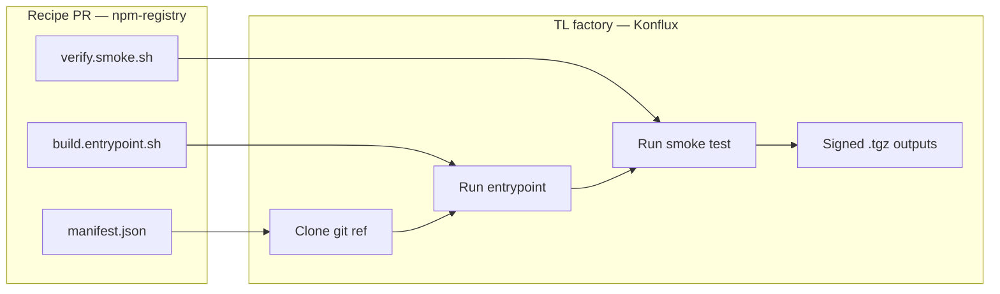
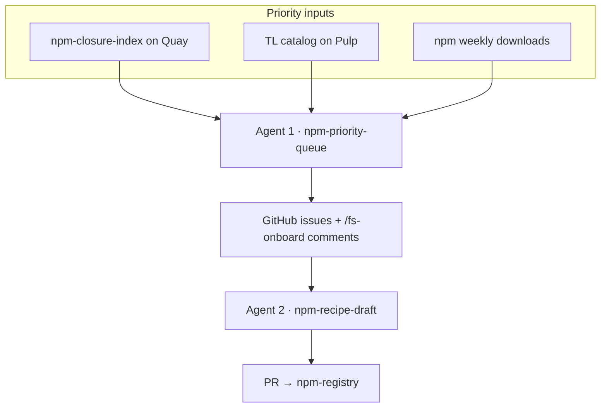
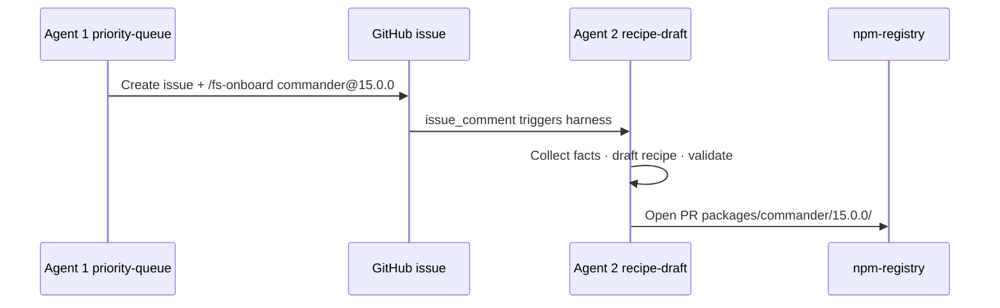
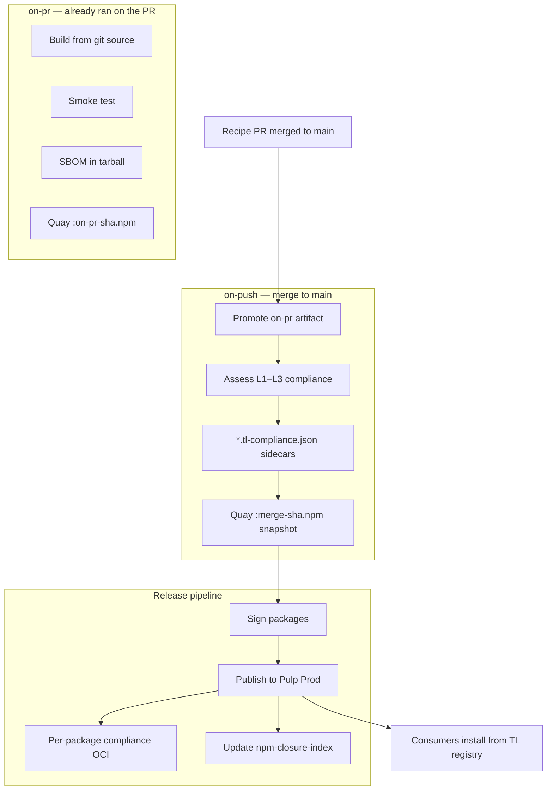

# npm Trusted Libraries — demo end-to-end flow

This document explains how the **npm-recipe-kitchen** PoC turns a candidate package into a Trusted Libraries (TL) publish on Pulp.
It covers the recipe model, the two Fullsend agents in this repository, and the Konflux factory that runs after a recipe PR merges to **npm-registry**.

---

## 1. What is an npm recipe?

Trusted Libraries for npm uses a **factory + recipe** model.
TL operates the factory — builder images, SBOM, signing, compliance assessment, and Pulp publish.
Onboarders supply a **recipe**: a small, reviewable bundle that tells the factory how to build one exact `name@version` from **git source**.

TL does **not** download tarballs from registry.npmjs.org and republish them.
Every onboarded version is built from the git `ref` declared in the recipe.

### Recipe layout

A recipe lives under `packages/<name>/<version>/` in [calungaproject/npm-registry](https://github.com/calungaproject/npm-registry).
Each version includes at minimum:

| File | Role |
|------|------|
| `manifest.json` | Metadata: identity, native tier, git source, output tarballs, script paths |
| `build.entrypoint.sh` | Non-interactive build run inside the TL builder; writes artifacts to `OUT_DIR` |
| `verify.smoke.sh` | Post-build checks (layout, CLI, module load, native sanity); must exit non-zero on failure |

Optional helpers (e.g. `tl-install.js`) may appear for Tier B/C packages that publish a platform binary alongside the main package.

### Native tiers

| Tier | Description | Example |
|------|-------------|---------|
| **A** | Pure JS; single main tarball | `semver`, `commander` |
| **B** | Main package + TL linux-x64 platform package | `esbuild`, `sharp` |
| **C** | Compile-heavy; strict review and smoke | node-gyp-heavy deps |

The manifest declares `outputs[]` — one entry per published tarball (main and, for Tier B/C, `@calunga/<name>-linux-x64`).

### What the factory reads from the manifest

```json
{
  "name": "commander",
  "version": "15.0.0",
  "native_tier": "A",
  "source": { "url": "https://github.com/tj/commander.js.git", "ref": "v15.0.0" },
  "entrypoint": "build.entrypoint.sh",
  "smoke": "verify.smoke.sh",
  "outputs": [{ "id": "main", "type": "npm-package", "path": "out/commander-15.0.0.tgz", "pulp_name": "commander" }]
}
```

Compliance level (`L1`–`L3`) is **not** authored in the manifest.
The pipeline computes it after build from packed `package.json` dependencies.



---

## 2. The two Fullsend agents

This kitchen repository runs **two agents in sequence**.
Deterministic scripts collect facts, validate output, and open GitHub issues or registry PRs.
The model handles ranking judgement and recipe drafting within those guardrails.



### Agent 1 — `npm-priority-queue`

**Specialty:** decide *what* to onboard next.

| | |
|---|---|
| **Trigger** | [`npm-priority-queue` workflow](.github/workflows/npm-priority-queue.yaml) — manual dispatch or Monday cron |
| **Deterministic work** | Pull closure index from Quay; list packages already on TL; score candidates **60% closure impact / 40% npm popularity**; validate `priority-result.json` |
| **Model work** | Pick top N from the shortlist; write per-entry rationale |
| **Output** | One GitHub issue per candidate (labels `npm-priority-candidate`, `npm-onboard`) with a `/fs-onboard name@version` comment that triggers Agent 2 |

Closure scoring favors packages that unblock other TL packages waiting on them in the global index.
Popularity scoring favors widely used packages when closure impact is equal.

### Agent 2 — `npm-recipe-draft`

**Specialty:** decide *how* to build a specific `name@version`.

| | |
|---|---|
| **Trigger** | `/fs-onboard <name@version>` issue comment (from Agent 1, a maintainer, or manual replay) |
| **Deterministic work** | Collect a trusted fact bundle (tarball integrity, git tag→commit, tier hints); validate and render recipe files; post-validate against facts |
| **Model work** | Infer native tier; draft `manifest.json`, `build.entrypoint.sh`, and `verify.smoke.sh` |
| **Output** | `drafted` → npm-registry fork + upstream PR; `needs_human` (with recipe files) → fork branch + review link, kitchen `recipes/drafts/` PR |

Agent 2 never signs, merges, or publishes.
A follow-up job (`npm-recipe-registry-publish` in `fullsend.yaml`) pushes the drafted bundle to npm-registry (or a fork) after the harness succeeds.



---

## 3. After the recipe PR merges

Once humans approve and merge the recipe PR to **npm-registry** `main`, the **Konflux factory** takes over.
No further kitchen or Fullsend involvement is required for build and publish.



### Stage summary

| Stage | When | What happens |
|-------|------|----------------|
| **on-pr** | Recipe PR open | Clone git `ref`; run `build.entrypoint.sh` and `verify.smoke.sh`; embed SBOM; push ephemeral Quay artifact |
| **on-push** | Merge to `main` | Promote the green on-pr artifact (no rebuild); query TL packument for packed dependencies; write compliance sidecars; push durable Quay snapshot |
| **Release** | Snapshot available | Extract tarballs; sign; upload to [Pulp Prod](https://packages.redhat.com/api/pulp-content/public-trusted-libraries/javascript/); mirror compliance to OCI; refresh closure index so waiters update when blockers land |

### Compliance levels (L1–L3)

Compliance describes where production dependencies may resolve at `npm install` time.
Publish is allowed at any level; production policy may require `L3`.

| Level | Meaning |
|-------|---------|
| **L1** | Mixed — some prod deps may still resolve from upstream npm |
| **L2** | Direct prod dependencies are on TL; transitive deps may still use npmjs |
| **L3** | Full production closure resolves only from TL (target for production apps) |

Packages with no TL dependencies (e.g. leaf packages) often reach **L3** on first publish.
Packages like `commander@15.0.0` typically start at **L1** or **L2** until their dependency tree is onboarded.

### Demo success criteria

After release completes for a package such as `commander@15.0.0`:

- The package appears in the TL npm catalog (`public-trusted-libraries/javascript/`)
- Signed `.tgz` is installable from the TL registry URL
- Compliance record exists on Quay (`calunga-npm-registry-main:<name-version>`)
- Closure index registers the package as a parent on any blockers in its gap lists

---

## Related reading

- Kitchen README — agent triggers, secrets, and local validation
- [npm-registry proposal](https://github.com/calungaproject/npm-registry/blob/main/docs/proposal-npm-lightwell-onboarding.md) — factory model, Validated vs Remediated, tiers, and compliance schema
- [on-push and release plan](https://github.com/calungaproject/npm-registry/blob/main/docs/plan-on-push-snapshot-release.md) — Konflux pipeline stages and Pulp target
